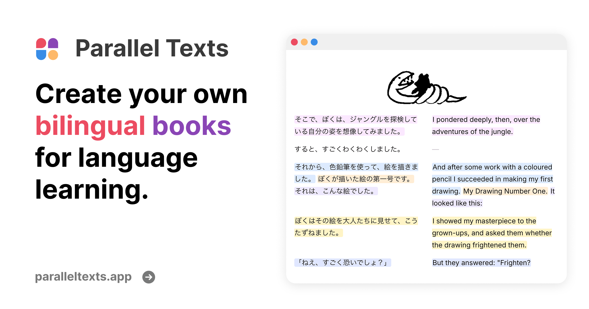
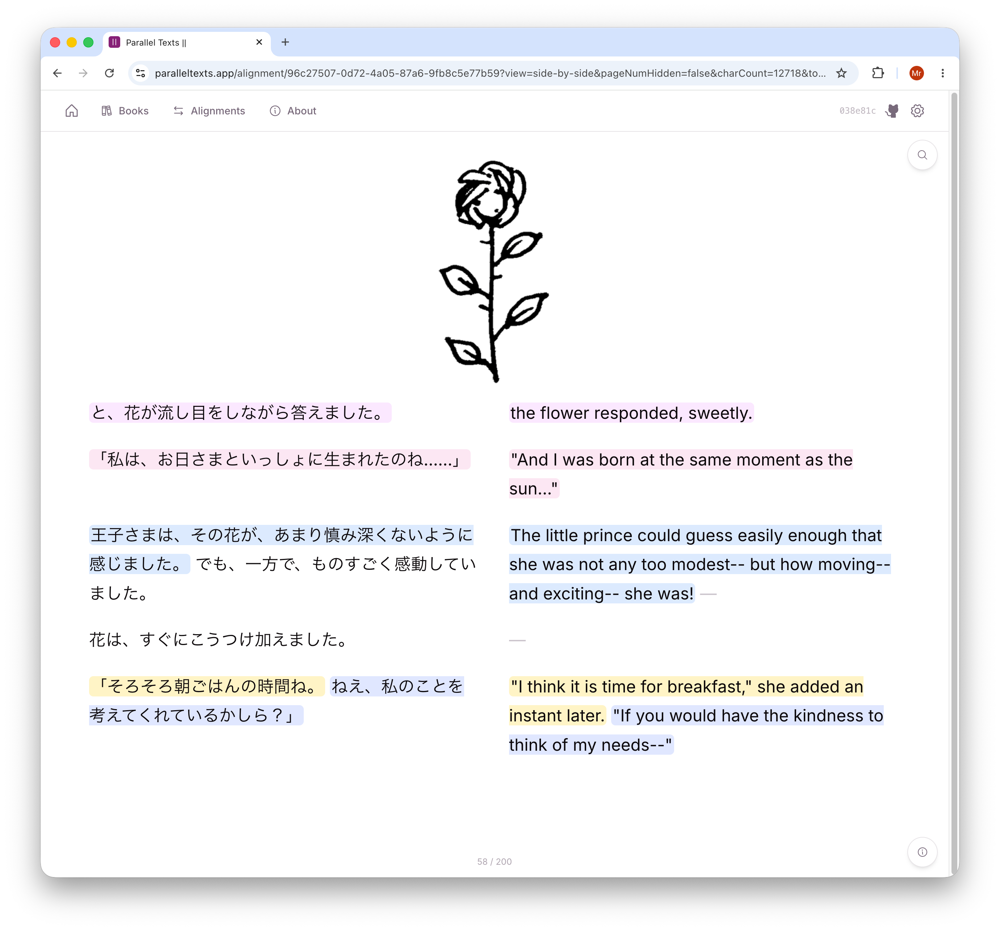
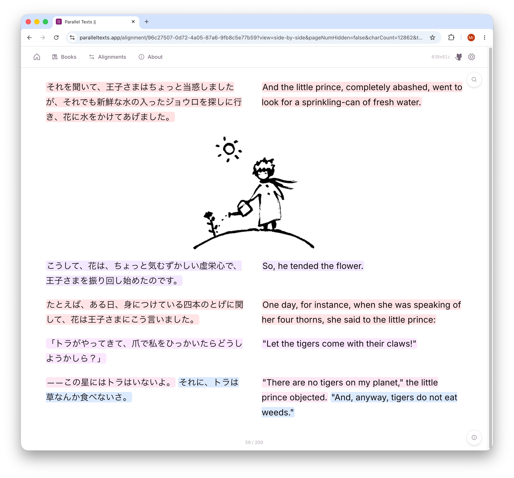
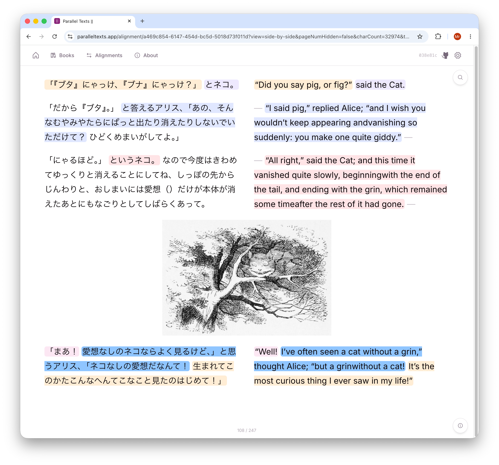
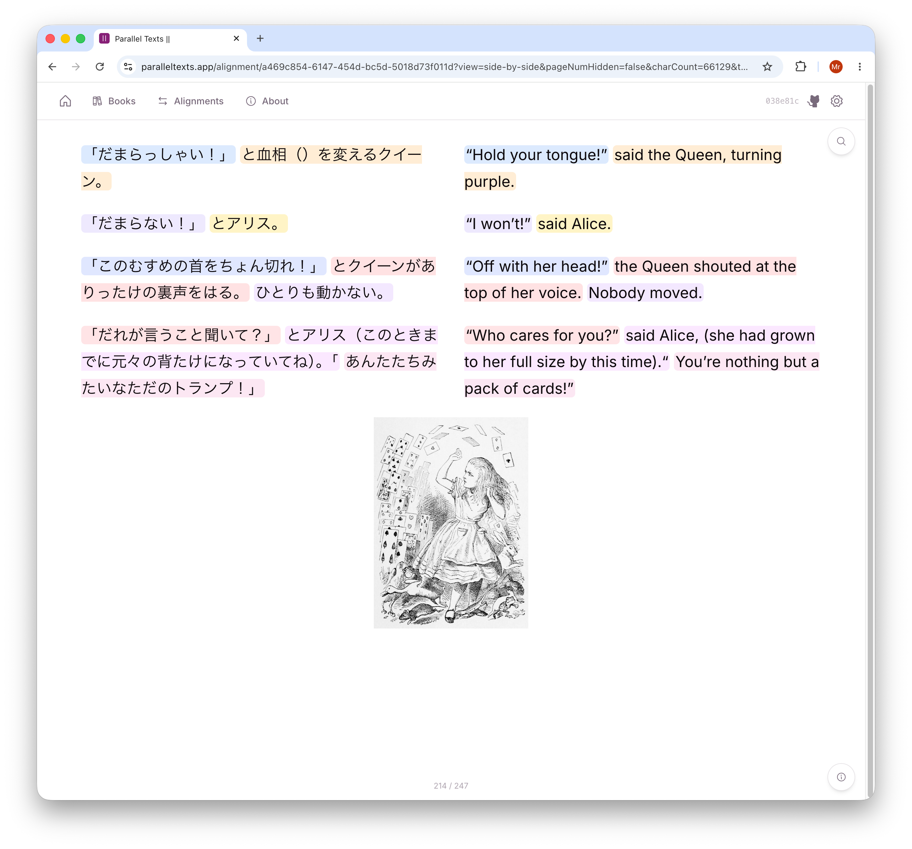
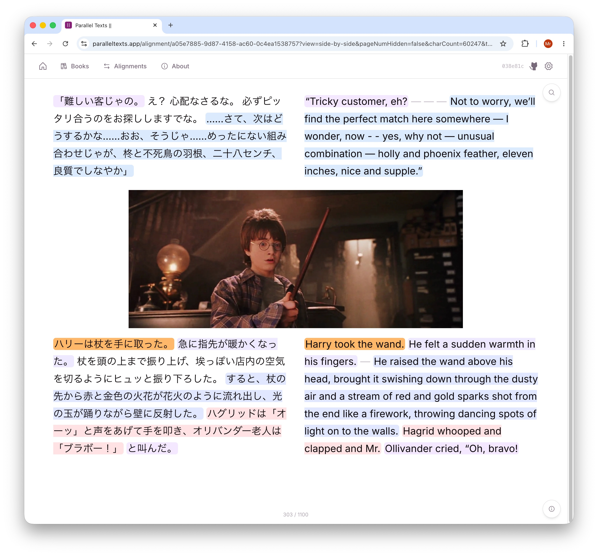
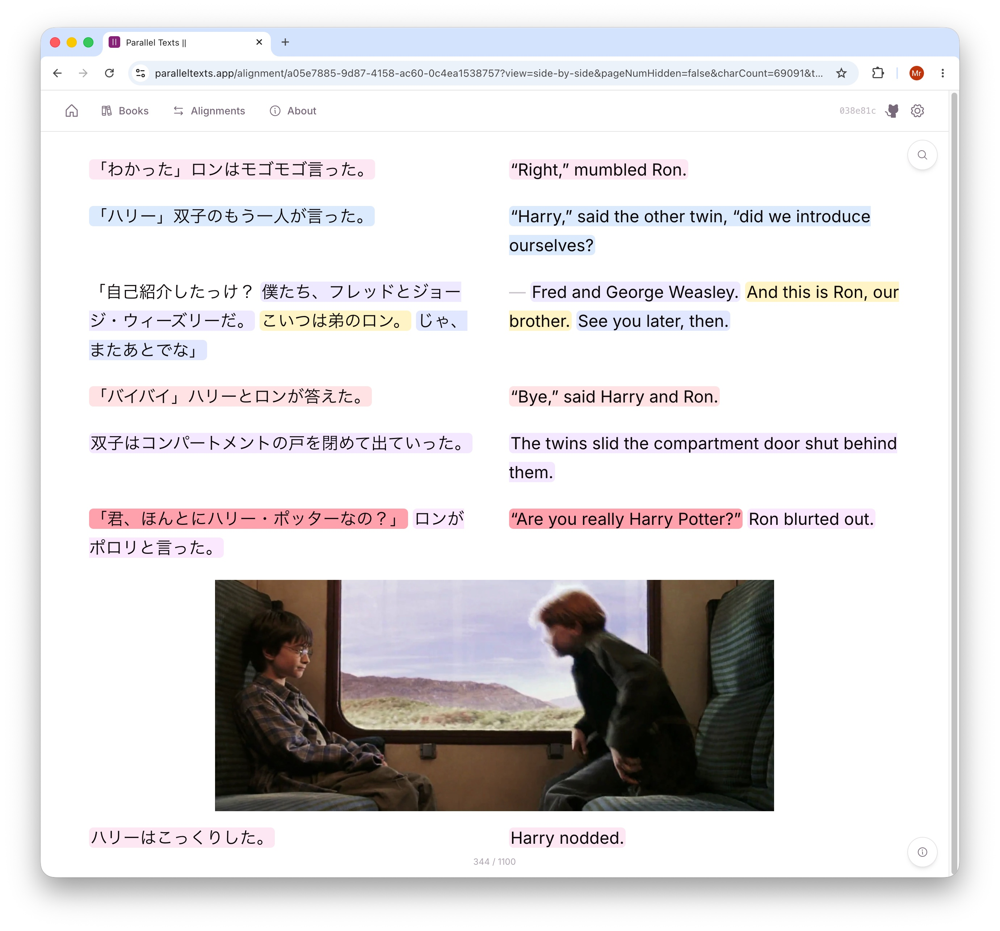
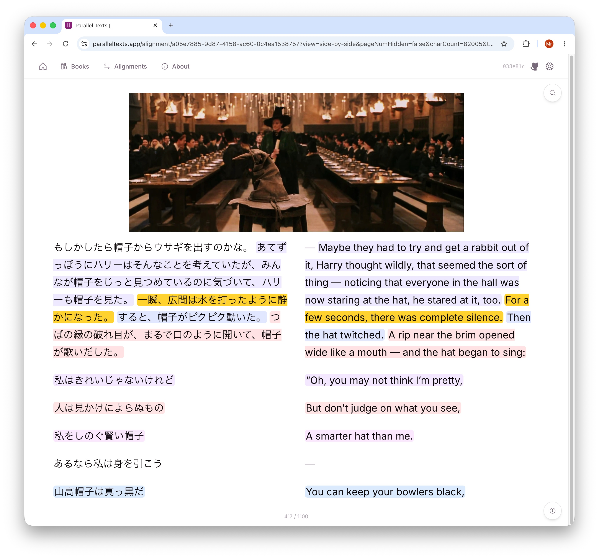
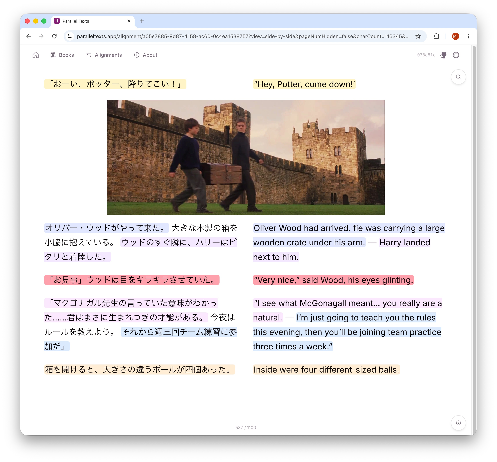

  

#  ParallelTexts

A free, fully in-browser tool for aligning two books in different languages sentence-by-sentence for creating [Parallel Texts](https://en.wikipedia.org/wiki/Parallel_text).

Upload a book and its translation (EPUB, PDF, or TXT), run the alignment pipeline entirely in your browser, then read the result as a paginated parallel ebook or export it as a TSV.

<table>
  <tr>
    <td>
      
    </td>
    <td>
      
    </td>
    <td>
      
    </td>
    <td>
      
    </td>
  </tr>
</table>

---

## Why the hell did I make this?

> "This is completely useless, why not just read a book as is with a popup dictionary and be done with it?"  

Yeah, normally I would agree, but I've recently had the misfortune of having a large portion of my time being forcefully spend on unimportant things like not immersing. I've simply decided that immersion, even if not "pure" immersion, is better than no immersion at all.

That being said, even if you find this useless, you might be interested in my [upcoming project](#upcoming-project) which aligns sentences and images instead.

## Features

- **Three input formats** — EPUB, PDF, and plain TXT.
- **Aligns sentences in 50+ languages** 
- **Fully in-browser ML** — The model runs in the browser, so no need for a backend. The tradeoff is that you have to download a model.
- **Two reading modes** — popover view (tap a sentence to see its translation) and side-by-side view.
- **TSV export and import** — one sentence pair per row; gap rows preserved; any 2- or 3-column TSV works on import.

---

## Use Cases

- **Beginner learning with real content** — align a book you're studying with a translation you already understand, then read sentence by sentence instead of grinding through a textbook
- **Reading above your level** — keep the original text in front of you while dipping into the translation only when you need it
- **Reading way way way above your level** — you've done one month of immersion and you're ready for [雪国](https://ja.wikipedia.org/wiki/%E9%9B%AA%E5%9B%BD_(%E5%B0%8F%E8%AA%AC)). sure bro.

---

## Upcoming project

Similar to this — but instead of aligning two texts, it aligns sentences in a book with **image frames from an adaptation** (anime, movie, drama, etc.).

Upload a light novel (or any book) plus a video or frame dump from its adaptation, and read with the corresponding scene right next to each sentence. Think *Monogatari* stills beside the original LN narration, or *Classroom of the Elite* images next to the LN text.

Feel free to hmu if you find this interesting.

ETA: ~2-6 months.

  

<table>
  <tr>
    <td>
      
    </td>
    <td>
      
    </td>
    <td>
      
    </td>
  </tr>
</table>

---

## License

ParallelTexts is licensed under the [GNU General Public License v3.0](LICENSE).

Copyright (c) 2026, nullspace05.

Third-party components (including BSD-3-Clause code adapted from
ttu-ttu/ebook-reader) are listed in
[`THIRD_PARTY_NOTICES.md`](THIRD_PARTY_NOTICES.md).

---

## Acknowledgements

Parts of the paginated book reader and reading-progress system are adapted from
[ttu-ttu/ebook-reader](https://github.com/ttu-ttu/ebook-reader) (BSD-3-Clause),
including:

- Character-count bookmarking (`exploredCharCount` approach) — see
  `src/lib/reading-progress.ts`
- CSS multi-column pagination workarounds for iOS/iPadOS WebKit — see
  `src/components/paginated-reader.tsx`

Full upstream license text: [`THIRD_PARTY_NOTICES.md`](THIRD_PARTY_NOTICES.md).
